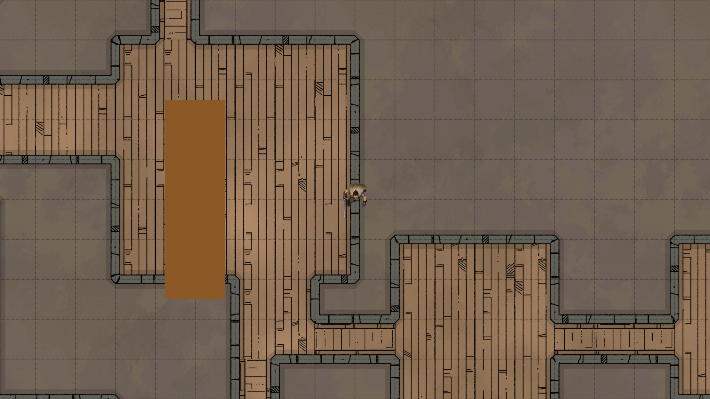

# Milestone 3 — Combat Mode Core



**Date:** February 2026

## What was built

This milestone delivers the first functional combat pass: a C key toggle that shifts the game into turn-based mode, enforces a movement budget, and renders a grid overlay — all wired to existing `PlayerController` and `PlayerStats` infrastructure.

### Combat Toggle

`CombatManager.EnterCombat()` / `ExitCombat()` are public methods called by the game — not bound to a key. Combat starts when the player steps on a trigger zone or targets an enemy with an attack or offensive spell action; it ends when the encounter resolves. One Input System action was added to the Player action map:

| Action | Keyboard | Gamepad |
|---|---|---|
| EndTurn | Enter | Left Shoulder |

### CombatManager

Scene singleton that owns the state machine and movement budget.

- Reads `PlayerStats.Speed` (default 6) as the turn budget on `EnterCombat()`
- `TryConsumeMovement(int cells)` — called by `PlayerController.MoveToCell` before each step; returns `false` and blocks movement when the budget is zero
- `EndTurn()` resets `movementRemaining` to `movementMax` and fires events
- Static events broadcast state to grid and HUD without direct references: `OnCombatStart`, `OnCombatEnd`, `OnTurnEnded`, `OnMovementChanged(int remaining, int max)`

### Grid Overlay

`CombatGrid` spawns 82 `LineRenderer` children at runtime (41 horizontal + 41 vertical), covering the full 40×40 cell map. No custom render passes or GL calls — fully URP-safe.

- Origin: (−20, −20) world space
- Cell size: 1 unit
- Color: white at 15% opacity, line width 0.02
- Sorting order: 5 (above map, below tokens)
- Shows on `OnCombatStart`, hides on `OnCombatEnd`

### Combat HUD

Screen Space Overlay canvas with two elements:

- **Movement label** — updates on every `OnMovementChanged` event: `"Movement: 4 / 6"`
- **End Turn button** — calls `CombatManager.Instance.EndTurn()`

Panel is hidden in FreeRoam and shown automatically when combat starts.

### Movement Budget Guard

`PlayerController.MoveToCell` now checks the budget before committing to a move:

```csharp
if (currentMode == MovementMode.Combat
    && CombatManager.Instance != null
    && !CombatManager.Instance.TryConsumeMovement(1))
    yield break;
```

This applies to both WASD steps and point-and-click moves.

### Research Notes

While studying how Fantasy Grounds handles tokens and maps, one useful finding: FG recommends **WebP** as the preferred token format for larger resolutions, citing file size. Unity 2022+ includes native WebP support via `ImageConversion` on all major platforms, so the token loading system will accept PNG, JPG, and WebP at the same import path with no additional libraries required. This will matter when token sheets and large-creature assets start accumulating.

### Tooling

- `CombatSetup` — editor tool (`Tools > Setup Combat`) that creates and wires all scene objects via `SerializedObject`, then saves the scene
- `CombatSmokeTest` — batch-mode test (`-executeMethod CombatSmokeTest.Run`) that exercises the full state machine; **22 / 22 assertions passing**
